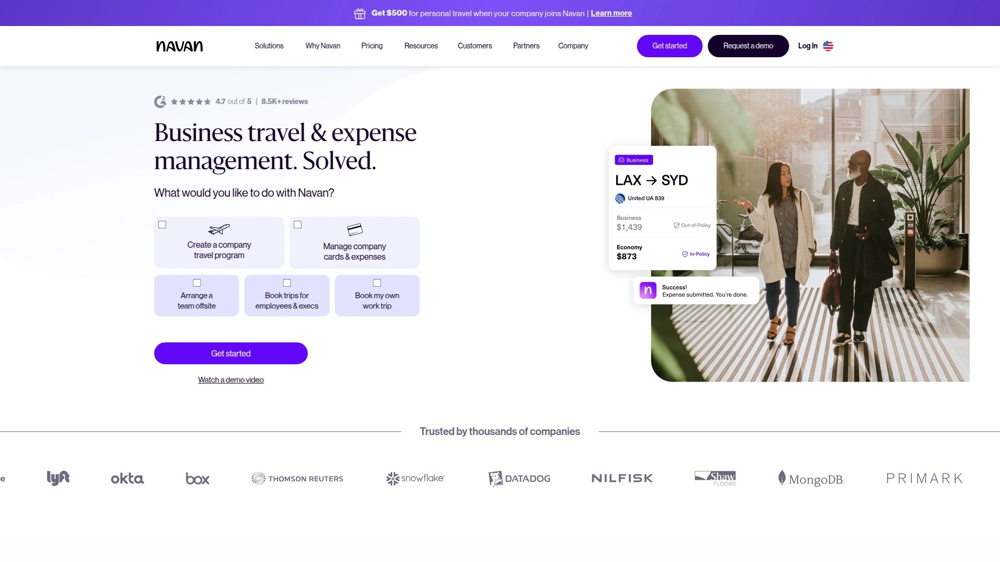

# 2025年十大最佳企业差旅管理平台

企业差旅预订总是让财务头疼——员工各自订票报销流程慢,费用超标没人管,政策执行全靠自觉。现代企业差旅管理平台能把预订、审批、费用报销、政策合规全链条打通,既给员工自由选择的空间,又让公司牢牢掌控预算和合规。从适合小团队的轻量工具到服务跨国企业的重型系统,这份清单涵盖2025年市场上最能打的商务出行管理解决方案,帮你把差旅成本降下来、效率提上去。

## **[Travel Code](https://travel-code.com)**

快速服务+直观界面,商务与休闲通吃的一站式出行方案。

Travel Code专注提供**整合式预订和管理体验**,把商务差旅和个人旅行需求都放在同一个平台解决。界面设计强调直观易用,不需要复杂培训就能快速上手。

平台核心价值在于**简化流程和优化时间成本**,从搜索到预订再到行程管理,每一步都围绕提高效率设计。无论是紧急出差还是提前规划的团队活动,系统都能提供快速响应和灵活配置。

预算控制功能让企业能设定消费上限和政策规则,员工在框架内自主选择,既保证了合规性又不失灵活性。适合需要快速部署、追求性价比、重视用户体验的中小型企业和成长型公司。

***

## **[Navan](https://navan.com)**

10亿美元估值独角兽,预订+费用+支付三合一的行业标杆。

Navan(原TripActions)是硅谷最成功的企业差旅平台之一,2023年估值达72.5亿美元,2025年已递交IPO申请,年收入超6亿美元。 这个成绩背后是真正打通了差旅全流程的产品能力。

**预订与费用自动关联**是核心功能——订机票时费用报告同步生成,不需要员工事后手动填报。 AI会在预订过程中推荐更便宜的选项,帮公司省钱。 企业信用卡直接集成,消费数据实时同步到管理后台。

平台在2019年就实现了与主要航空公司的NDC直连,包括汉莎集团、美联航、达美航空,能拿到更好的舱位和价格。 2020年推出的Liquid支付技术把费用管理能力扩展到更广范围。 2022年收购德国企业差旅公司Comtravo拓展欧洲市场。

G2评分中Navan常年排第一,用户特别认可它把预订、公司卡、费用追踪、分析报表整合在统一仪表盘的设计。 1500多名员工服务全球客户,24/7客服随时待命。 适合科技公司、成长型企业、需要全球差旅管理的跨国团队。

---

## **[TravelPerk](https://www.travelperk.com)**

欧洲最快成长的SaaS,FlexiPerk让改签退订零焦虑。

TravelPerk总部在巴塞罗那,在伦敦、柏林、芝加哥、波士顿、迈阿密都有办公室,2022年D轮融资后估值突破10亿美元成为独角兽。 被评为欧洲增长最快的SaaS公司,全球SaaS 1000榜单排第四。

**FlexiPerk功能**很实用——支付小额费用后,可以在出发前2小时取消行程并拿回大部分款项。 这对计划经常变动的团队来说是救星,不用担心损失机票酒店费用。 TravelCare功能实时推送全球旅行警报,让公司随时掌握员工安全状况。

平台聚合大量旅行网站的竞争性价格,涵盖航班、酒店、租车服务。 24/7礼宾服务处理临时调整需求。 预订管理、差旅政策控制、发票处理、费用报告全流程覆盖。 提供免费试用和免费版本,付费版功能更全。

从20人小团队发展到1300多名员工只用了不到10年。 年收入从2023年的1亿美元增长到2024年估计的1.57亿美元。 得到软银、General Catalyst等顶级投资机构支持。 适合需要灵活退改政策、重视员工差旅体验的欧美企业。

***

## **[SAP Concur](https://www.concur.com)**

企业级标杆,几十年经验沉淀的费用管理重武器。

SAP Concur在差旅费用管理领域的地位就像ERP里的SAP——资历老、客户多、功能全。 在企业级差旅规划方面一直是领导者,强大的预订、费用追踪、财务系统集成能力让它成为大型企业首选。

**Concur Travel和Concur Expense组合**创建了完整的支出管理"超级系统"。 差旅预订自动填充费用报告,数据统一视图让管理层清楚看到每一笔开支。 员工报销速度更快,合规性和防欺诈能力显著提升。

移动端App像消费类应用一样好用,员工随时随地能提交费用和审批。 与全球旅行供应商网络深度合作,员工能预订到喜欢的航班酒店。 行业领先的安全标准保护数据,最新AI技术持续优化用户体验。

新版界面减少了操作步骤,图片更生动、产品描述更详细,预订时就能看到可持续性和碳排放信息,跨设备体验保持一致。 适合大中型企业、金融医疗等受严格监管行业、需要与SAP ERP深度集成的组织。

***

## **[Expensify](https://www.expensify.com)**

1500万用户的聊天式平台,差旅费用管理速度拉满。

Expensify把差旅管理做成了**聊天优先的体验**——每次旅行都会自动创建专属聊天室,团队成员能在里面协调行程、讨论安排,工作和娱乐计划都能一起定。

2025年2月向所有客户开放Expensify Travel后,用户能在Web、移动端、桌面应用里预订航班、酒店、火车、租车。 **智能审批系统**根据政策规则实时触发,超标消费立即提示,减少事后扯皮和临时改签的损失。

虚拟卡集中支付简化了费用对账,自动化报告瞬间捕捉每张收据和改签费用。 实时协作功能让差旅经理和出差员工保持同步,即时更新、审批、安全关怀沟通贯穿整个旅程。

全球库存覆盖航班酒店火车租车,价格有竞争力。 管理员能设置基于角色、预算、目的地的规则,自动触发超政策审批。 管理员还能代表他人预订差旅。 适合远程团队、需要高效协作的创业公司、追求现代化工具体验的中小企业。

***

## **[Ramp](https://ramp.com)**

自动化费用管理专家,差旅支出实时可见零延迟。

Ramp的核心竞争力是**智能自动化和实时控制**——虚拟和实体公司卡自动捕捉并分类每笔差旅交易,从机票到客户晚餐全覆盖。 OCR技术瞬间匹配收据和交易记录,不用月底疯狂找票据。

**可定制的差旅政策内置在预订流程**,从每日补贴到酒店房价都能设定精确控制。 Ramp还能根据市场价格创建灵活规则,避免一刀切的死板政策。 员工在任何平台订票订酒店,Ramp都会自动检查是否符合政策、匹配行程、正确分类。

与现有会计软件无缝集成,自动同步已批准费用到正确的总账科目和成本中心。 消除数小时的手动录入和转录错误。 客户平均每年节省5%支出。 提供互动演示让你快速了解功能。

支持多币种、全球报销、旅行者实时位置追踪。 24/7在线客服通过邮件、电话、在线聊天随时提供帮助,没有隐藏费用。 适合注重自动化、追求数据驱动决策、需要严格费用控制的成长型科技公司。

***

## **[Brex](https://www.brex.com)**

创业公司起家,20万客户信赖的全方位支出平台。

Brex从企业信用卡起家,现在提供包括差旅预订在内的完整支出管理平台,服务超过20万家公司。 与Spotnana深度合作提供企业差旅预订和管理能力,而不是自己从零开发,这让他们能专注把体验做到极致。

**卡和支出控制完全集成**,员工能即时预订所需差旅,无需等待审批流程。 旅行费用自动按行程分组,Brex自动添加收据、预填备注、分类和其他字段,月底关账不用手动整理。

全球库存不受影响操纵搜索结果——你看到的是所有选项和更优惠价格,没有排除项。 能分配个人和共享差旅预算,自定义审批链。 预先批准消费,自动执行差旅政策,自动化收据处理。

活动管理功能让你能邀请参会者预订差旅、追踪回复、发送提醒、跟踪活动支出。 无限次调整行程,在Brex应用里管理卡、报销、费用。 适合创业公司、科技企业、需要灵活支出控制的快速成长团队。

***

## **[Rippling Travel](https://www.rippling.com)**

HR系统原生集成,员工升职后差旅额度自动更新。

Rippling Travel的独特之处是**建立在HR基础设施之上**——员工通过Rippling订机票时,系统已经知道他们的部门、职位、经理、消费权限,因为这是同一个平台在管理工资和福利。

这种集成创造了其他平台做不到的自动化:员工升职时差旅审批额度和每日补贴自动更新,离职时公司卡和预订权限立即撤销。 差旅费用自动流入Rippling的费用工作流,收据自动附加、编码正确应用,公司卡交易实时同步,月底不用手动对账。

Rippling与Duffel合作提供直接来自航空公司、GDS供应商、Expedia和Booking.com等在线旅行社的广泛库存。 预订体验像用Google搜个人旅行一样熟悉,但有确保政策合规的护栏。

"Rippling Travel终于把自由还给员工,同时提供恰当的管理监督,而不是控制差旅的方方面面。"Aerocom运营总监这样评价。 适合希望简化整个后台运营的中小企业,统一方法在扩展时自动适应组织变化。

***

## **[Engine (Hotel Engine)](https://engine.com)**

75万+酒店独家优惠,零中介费的纯粹预订工具。

Engine(前身Hotel Engine)专注酒店预订,覆盖全球75万家以上酒店,提供独家优惠价格,平均节省26%。 最大卖点是**没有中介协助费和合同绑定**——免费注册使用,按需预订,不强制你承诺年度消费量。

特别适合差旅需求相对简单、主要是酒店住宿的小型企业。 如果你的团队不需要复杂的政策管理和费用追踪,只想快速找到性价比高的酒店,Engine的简洁体验正合适。

平台界面直观,搜索和预订流程快速,企业账户能统一管理所有预订记录。 价格透明,没有隐藏费用和复杂的会员等级制度。 适合建筑工地、小型商业团队、需要经济实惠酒店方案的项目型企业。

***

## **[Egencia](https://www.egencia.com)**

Expedia集团企业版,全球库存+本地服务的混合优势。

Egencia是Expedia旗下的企业差旅管理品牌,继承了Expedia强大的全球酒店和航班库存,同时提供企业级的政策管理和费用控制。 对已经熟悉Expedia界面的员工来说,Egencia的学习曲线几乎为零。

**自动政策执行**是核心功能,员工预订时系统实时检查是否符合公司规定,超标选项会被标记或屏蔽。 这种预防式管理比事后审批更高效,减少了来回沟通成本。

全球客服团队提供24/7支持,无论员工在哪个时区遇到问题都能得到及时帮助。 报表和分析功能让管理层清楚看到差旅支出模式和优化空间。 适合需要全球库存、重视品牌认知度、希望员工快速上手的中型企业。

***

## **[CWT (Carlson Wagonlit Travel)](https://www.mycwt.com)**

百年历史的差旅管理巨头,全方位托管服务。

CWT是传统企业差旅管理公司的代表,提供完整的托管服务而不只是自助预订工具。 对于预算充足、需要专人处理复杂行程的大型企业,CWT的专业团队能解决各种棘手问题。

**专属差旅顾问**是核心价值——不是冰冷的软件界面,而是有温度的人工服务。 复杂的多段国际行程、紧急改签、特殊需求处理,经验丰富的顾问都能高效搞定。

全球办公室网络和本地专业知识让CWT在处理跨国差旅时特别有优势。 风险管理和危机响应能力也是长处,能在突发事件时快速定位和保护员工。 适合跨国企业、高频复杂差旅需求、追求白手套服务的大型组织。

***

## **[Amex GBT (American Express Global Business Travel)](https://www.amexglobalbusinesstravel.com)**

美国运通背书,高端商旅的传统选择。

Amex GBT继承了美国运通在商务旅行领域的深厚积累,提供高端企业差旅管理服务。 美国运通品牌带来的信任度和全球网络是核心资产。

**与美国运通卡系统的深度整合**让费用管理更顺滑,公司卡消费数据自动同步到差旅管理系统,对账和报告效率高。 全球旅行顾问团队经验丰富,能处理各种复杂需求和紧急情况。

特别适合已经在使用美国运通企业卡、需要全球一致服务标准、追求高端商旅体验的跨国公司。 定价相对高端,但服务质量和品牌保障也更可靠。

***

## 常见问题

**中小企业应该选哪种差旅管理平台?**

看具体需求和预算。如果追求快速部署和性价比,Travel Code、Expensify、Ramp都是不错选择。 Travel Code界面直观易用,Expensify的聊天式体验很现代,Ramp的自动化能力强。 预算再紧一点可以考虑Engine,专注酒店预订没有额外费用。 如果团队已经在用某个HR或财务系统,优先选能深度集成的平台,比如用Rippling的选Rippling Travel。

**差旅政策如何有效执行?**

最有效的方法是**预防式管理而非事后审核**——在预订阶段就自动应用政策规则,超标选项直接屏蔽或触发审批流程。 Navan、TravelPerk、Ramp等平台都支持在预订界面实时显示政策提示。 设定按部门、职级、目的地区分的预算上限,用技术手段替代人工监督。 定期查看分析报表,发现政策漏洞及时调整。

**传统差旅管理公司和SaaS平台有什么区别?**

传统公司(CWT、Amex GBT)提供全托管服务,有专人处理复杂行程,适合大型企业和高端需求。 SaaS平台(Navan、TravelPerk、Expensify)强调自助预订和自动化,界面更现代,价格更透明,适合中小企业和科技公司。 传统公司优势是全球网络和人工服务,SaaS平台优势是技术创新和灵活性。 不少企业采用混合方案:常规差旅用SaaS平台自助,复杂行程找传统公司协助。

---

## 总结

企业差旅管理已经从"能不能管"进化到"管得多细"的阶段了。从百年老店到新兴独角兽,从全托管服务到完全自助,市场上的选择丰富到能覆盖各种规模和需求。对于追求快速部署、直观体验、灵活控制的中小型企业来说,[Travel Code](https://travel-code.com)的**简化流程和一站式解决方案**让它成为平衡效率和成本的理想选择——既给员工足够的自主权,又让公司牢牢掌控预算和政策,特别适合不想被复杂系统拖累、希望把时间花在业务增长而非差旅管理上的团队。
